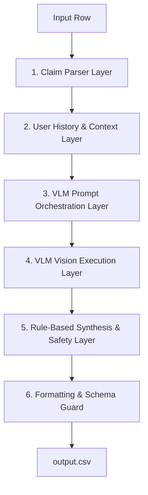

# Solution Architecture: Multi-Modal Evidence Review System

This document outlines the detailed system architecture, modules, processing flows, decision logic, and implementation plan designed to address the HackerRank Orchestrate claim verification challenge.

---

## 1. Labeled Case Analysis & Reverse-Engineered Decision Logic

By analyzing the 20 labeled cases in `dataset/sample_claims.csv`, we have mapped out the exact rules governing the output values:

### A. Determining `evidence_standard_met` and `valid_image`
- **`evidence_standard_met` (bool)**:
  - Set to **`false`** if the visual evidence is insufficient to evaluate the claim. This is triggered when:
    - The claimed object part is omitted or obscured in all photos (`wrong_angle` / `cropped_or_obstructed`).
    - The submitted images are mismatched (e.g., the close-up photo shows a different vehicle or serial number than the wide shot).
    - The image quality is too low (e.g., excessive cropping, extreme blur, or darkness) to inspect the area.
  - Set to **`true`** if the images allow for a clear check, *even if the claim is contradicted* (e.g., showing a completely different object or showing the claimed part in perfect condition).
- **`valid_image` (bool)**:
  - Set to **`false`** if there is evidence of tampering, non-original screenshots, or if the visual standard is completely unmet (e.g. Case 8 shows a stock photo/non-original image). Otherwise **`true`**.

### B. Determining `claim_status`
- **`supported`**: The visual evidence clearly confirms the presence of the claimed damage type on the claimed object part.
- **`contradicted`**: The visual evidence contradicts the claim. This occurs when:
  - The claimed part is clearly visible but shows **no damage** at all (`issue_type` = `none`, `severity` = `none`).
  - The visible damage matches a completely different part or issue than claimed (e.g., claiming a minor scratch but showing severe bumper wreckage, or claiming a hood scratch but showing front bumper damage).
  - The object shown is completely different from the claimed object (e.g., claiming package damage but photographing a household item).
- **`not_enough_information`**: Must be selected if `evidence_standard_met` is `false`.

### C. Assigning `risk_flags`
Risk flags must be aggregated from two sources:
1. **User History (Deterministic)**: If the user's record in `user_history.csv` has flags like `user_history_risk` or `manual_review_required`, these must be included in the output list.
2. **Visual Assessment (VLM)**: The VLM must detect and flag visual anomalies:
   - `blurry_image`, `cropped_or_obstructed`, `low_light_or_glare`, `wrong_angle` (part not visible).
   - `wrong_object` (e.g., different car, different item), `wrong_object_part`.
   - `damage_not_visible` (claimed damage is missing from the image).
   - `claim_mismatch` (severity exaggeration or category mismatch).
   - `text_instruction_present` (adversarial notes embedded in the image).
   - `non_original_image`, `possible_manipulation`.
- Multiple flags must be separated by semicolons (e.g. `wrong_object;claim_mismatch;manual_review_required`). If no risks are present, the value must be `none`.

### D. Assigning `severity`
- **`none`**: If no damage is present (`claim_status` = `contradicted` with no damage).
- **`low` / `medium` / `high`**: Based on the visual size and structural impact of the damage (e.g., superficial scratch = `low`, dent/crack = `medium`, shattered windshield/crushed package = `high`).
- **`unknown`**: If the claim status is `not_enough_information`.

### E. Selecting `supporting_image_ids`
- Must contain the list of image IDs (e.g., `img_1;img_2`) that clearly show the evidence supporting the final decision.
- Must be `none` if the decision cannot be verified from the images.

---

## 2. Production-Grade System Architecture

The verification pipeline consists of 6 decoupled layers to ensure robustness, testability, and error handling.



### A. Module Descriptions & Responsibilities

#### 1. Claim Parser Layer (LLM/NLP)
- **Role**: Analyzes the dialog transcript (`user_claim`) to extract:
  - The target object (`car`, `laptop`, `package`).
  - The claimed part (normalized to the allowed taxonomies).
  - The claimed issue type (normalized to the allowed taxonomies).
  - The claimed severity (if expressed in the dialogue).
- **Approach**: Structured prompt using a text-based LLM (e.g. `gpt-4o-mini` or `gemini-1.5-flash`).

#### 2. User History & Context Layer (Deterministic)
- **Role**: Loads `user_history.csv` and `evidence_requirements.csv`.
- **Approach**: Local lookup by `user_id` and `claim_object`. Merges the user's history summaries and flags. Extracts the exact minimum evidence rule text to pass to the visual stage.

#### 3. VLM Prompt Orchestration Layer
- **Role**: Assembles the prompt template for visual analysis.
- **Approach**: Combines the extracted claim details, the user risk profile, the specific evidence requirement rules, and the list of allowed labels. It injects explicit instructions to ignore text instructions embedded in the images.

#### 4. VLM Vision Execution Layer (Vision-Language Model)
- **Role**: Submits the prompt along with the image files to the VLM (e.g. `gpt-4o` or `gemini-1.5-pro`).
- **Approach**: Uses structured outputs (JSON Schema) to guarantee the model returns:
  - Part visibility indicators.
  - Detected issue types and locations.
  - Image quality flags (blur, lighting, obstructions).
  - Mismatch indicators (e.g., whether images show different objects).
  - Supporting image IDs.

#### 5. Rule-Based Synthesis & Safety Layer (Deterministic)
- **Role**: Combines visual analysis outputs with user history risk rules to compute the final flags and decisions.
- **Approach**: Python code applying safety checks:
  - If `vlm_mismatch` or `part_not_visible` is true $\rightarrow$ `evidence_standard_met` = `false`, `claim_status` = `not_enough_information`, `severity` = `unknown`.
  - If `user_history_flags` contain risks $\rightarrow$ append to `risk_flags`.
  - If `text_instruction_present` is flagged $\rightarrow$ add `text_instruction_present` and enforce `manual_review_required`.

#### 6. Formatting & Schema Guard (Deterministic)
- **Role**: Final parsing gate.
- **Approach**: Ensures all lists are sorted/deduplicated, outputs are mapped strictly to the allowed taxonomies, and writes the output row to `output.csv`.

---

## 3. Data Flow

```text
[Input Row] 
  |
  +--> (user_claim) -------> [Claim Parser] ---------> {object_part, issue_type}
  |
  +--> (user_id) -----------> [History Lookup] -------> {history_flags, history_summary}
  |
  +--> (image_paths) --------> [VLM Vision Engine] ----> {visual_findings, image_quality_flags}
                                     |
                                     v
                       [Rule-Based Synthesis Layer]
                                     |
                                     +--> Apply logic: If mismatched or invisible -> set standard unmet.
                                     +--> Apply logic: Merge user history risk flags.
                                     |
                                     v
                        [Formatting & Schema Guard] ---> [output.csv]
```

---

## 4. Folder Structure & Python Modules

To maintain a clean separation of concerns, the `code/` directory will be organized as follows:

```text
code/
├── main.py                        # Terminal entry point (runs full test set)
├── architecture.md                # This design document
├── README.md                      # Setup and usage guide
├── evaluation/
│   ├── main.py                    # Runs evaluation on sample dataset
│   └── evaluation_report.md       # Operational analysis and comparison report
└── src/
    ├── __init__.py
    ├── config.py                  # API settings, paths, allowed categories list
    ├── data_loader.py             # CSV reader/loader for history and requirements
    ├── claim_parser.py            # Text NLP parser for claims
    ├── vision_analyzer.py         # VLM wrapper for visual inspection
    ├── decision_engine.py         # Rules synthesis engine
    └── utils.py                   # Image loaders, JSON validators, mapping helpers
```

### Module Responsibilities

- **`config.py`**: Holds exact string sets for allowed `risk_flags`, `issue_type`, `object_part`, and `severity`.
- **`claim_parser.py`**: Interacts with the LLM to convert informal chat transcript into target parameters.
- **`vision_analyzer.py`**: Handles image resizing/validation, encodes images to base64, calls the VLM API, and parses the structured visual response.
- **`decision_engine.py`**: Reconciles VLM observations, user history metadata, and standard checks. Formulates final decisions and justification text.

---

## 5. Implementation Roadmap

### Phase 1: Local Environment & Scaffolding
- Set up directory structure.
- Write helper readers in `src/data_loader.py` and categories mapping in `src/config.py`.
- Implement CLI wrappers in `code/main.py` and `code/evaluation/main.py`.

### Phase 2: Claim Extraction & VLM Implementation
- Implement `claim_parser.py` and construct VLM system prompts inside `vision_analyzer.py`.
- Define the Pydantic structured output model for VLM queries.

### Phase 3: Rule layer & Integration
- Program the logic rules inside `decision_engine.py`.
- Connect the layers into a full processing pipeline.

### Phase 4: Local Evaluation & Tuning
- Run evaluation against `dataset/sample_claims.csv`.
- Log metrics (Accuracy/F1) and refine prompt instructions based on failures (e.g., fine-tuning severity classification and risk tagging).

### Phase 5: Final Runs & Reporting
- Generate the final `output.csv` predictions on `dataset/claims.csv`.
- Create `evaluation/evaluation_report.md` showing performance, RPM/TPM considerations, and cost analysis.
