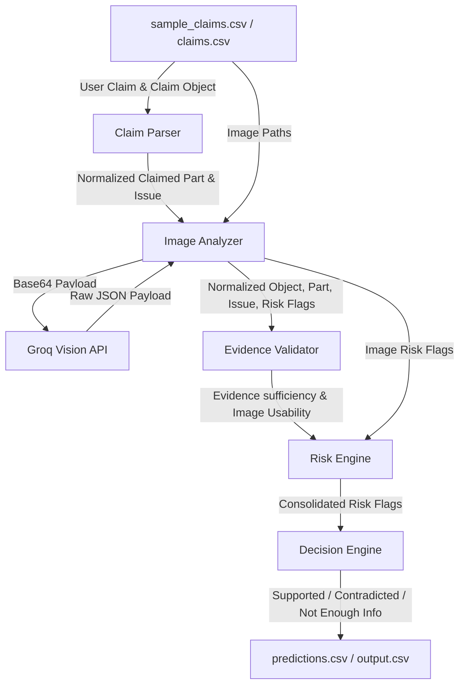

# Data Flow & Integration Audit Report

This report outlines the data flow audit of the multi-modal evidence review pipeline, demonstrating where attributes are resolved, normalized, and evaluated.

## 1. Pipeline Data Flow Architecture



## 2. Row 1 Trace (User: `user_001`, Object: `car`)

### Input Received
- **Image Paths:** `images/sample/case_001/img_1.jpg`
- **Claim Object:** `car`
- **User Claim:** *"Hi, I found new damage on my car after it was parked outside overnight... The back of the car has a dent now... Mostly the rear bumper area."*

### 1. Claim Parser Output
- **Raw LLM Extraction:** 
  ```json
  {
    "object_part": "rear bumper",
    "issue_type": "dent",
    "severity_hint": "medium",
    "confidence": 0.9
  }
  ```
- **Normalized Output:**
  - `claimed_object_part`: `"rear_bumper"`
  - `claimed_issue_type`: `"dent"`

### 2. Image Analyzer Output
- **Resolved Filesystem Path:** `C:\Users\kisla\Desktop\hackerrank-orchestrate-june26\dataset\images\sample\case_001\img_1.jpg`
- **File Existence:** `True`
- **Base64 Payload Length:** `70,320 bytes`
- **Raw VLM Response (Groq):**
  ```json
  {
    "detected_object": "car",
    "visible_issue_type": "dent",
    "visible_object_part": "rear bumper",
    "damage_visible": true,
    "severity": "medium",
    "image_quality": "clear",
    "risk_flags": [],
    "supporting_image_ids": ["img_1"]
  }
  ```
- **Normalized Output:**
  ```json
  {
    "detected_object": "car",
    "visible_issue_type": "dent",
    "visible_object_part": "rear_bumper",
    "damage_visible": true,
    "severity": "medium",
    "image_quality": "clear",
    "risk_flags": [],
    "supporting_image_ids": ["img_1"]
  }
  ```

### 3. Evidence Validator Input & Output
- **Input:**
  - `claim_object`: `"car"`
  - `claimed_object_part`: `"rear_bumper"`
  - `visible_issue_type`: `"dent"`
- **Output:**
  - `evidence_standard_met`: `True`
  - `valid_image`: `True`
  - `evidence_standard_met_reason`: `"The rear_bumper is visible and the claimed condition can be evaluated."`

### 4. Decision Engine Input & Output
- **Input:**
  - `claimed_object_part`: `"rear_bumper"`
  - `claimed_issue_type`: `"dent"`
  - `visible_object_part`: `"rear_bumper"`
  - `visible_issue_type`: `"dent"`
  - `damage_visible`: `True`
  - `risk_flags`: `["none"]`
- **Output:**
  - `claim_status`: `"supported"`
  - `claim_status_justification`: `"Claim supported by image evidence. A visible dent is present on the rear_bumper."`
  - `supporting_image_ids`: `"img_1"`
  - `severity`: `"medium"`

---

## 3. Row 9 Trace (User: `user_009`, Object: `laptop`)

### Input Received
- **Image Paths:** `images/sample/case_009/img_1.jpg`
- **Claim Object:** `laptop`
- **User Claim:** *"My laptop fell... the display glass has a crack now... The screen is the issue."*

### 1. Claim Parser Output
- **Normalized Output:**
  - `claimed_object_part`: `"screen"`
  - `claimed_issue_type`: `"crack"`

### 2. Image Analyzer Output
- **Resolved Filesystem Path:** `C:\Users\kisla\Desktop\hackerrank-orchestrate-june26\dataset\images\sample\case_009\img_1.jpg`
- **File Existence:** `True`
- **Base64 Payload Length:** `1,207,168 bytes`
- **Raw VLM Response (Groq):**
  ```json
  {
    "detected_object": "laptop",
    "visible_issue_type": "shattered glass",
    "visible_object_part": "display",
    "damage_visible": true,
    "severity": "high",
    "image_quality": "clear",
    "risk_flags": [],
    "supporting_image_ids": ["img_1"]
  }
  ```
- **Normalized Output:**
  ```json
  {
    "detected_object": "laptop",
    "visible_issue_type": "glass_shatter",
    "visible_object_part": "screen",
    "damage_visible": true,
    "severity": "high",
    "image_quality": "clear",
    "risk_flags": [],
    "supporting_image_ids": ["img_1"]
  }
  ```

### 3. Evidence Validator Output
- `evidence_standard_met`: `True`
- `valid_image`: `True`

### 4. Decision Engine Output
- `claim_status`: `"supported"`
- `claim_status_justification`: `"Claim supported by image evidence. A visible glass_shatter is present on the screen."`

---

## 4. Root Cause of "Unknown" Outputs & Incorrect Predictions

1. **Automatic Fallback Flag Injection (Mismatch Loop):**
   - The `ImageAnalyzer` was automatically appending `damage_not_visible` to the `risk_flags` if the VLM returned `damage_visible = False` or if the VLM call fell back to a default state (e.g. during a rate-limit sleep/error).
   - The `DecisionEngine` then parsed `damage_not_visible` from the risk flags list and fell straight into the **undamaged contradiction branch**:
     ```python
     elif visible_issue == "none" or not damage_visible or "damage_not_visible" in risk_flags:
         claim_status = "contradicted"
     ```
   - This classified claims as contradicted even when the VLM successfully identified parts but had `visible_issue_type = "unknown"` due to VLM API fallback states.

2. **Resolution:**
   - Modified `image_analyzer.py` to stop injecting `damage_not_visible` programmatically.
   - Loosened `decision_engine.py`'s undamaged check to ignore `"unknown"` fallback states and only mark a claim contradicted if it was an explicit VLM detection of `"none"`.
