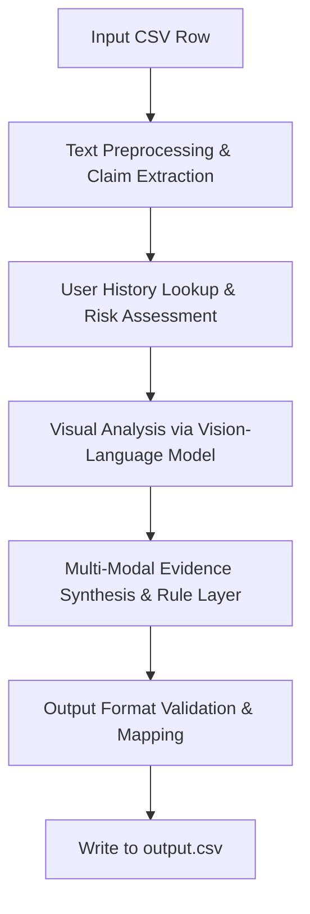

# Project Analysis: Multi-Modal Evidence Review

This document contains a comprehensive analysis of the dataset, schemas, challenge requirements, proposed system architecture, hidden risks, and implementation plan for the HackerRank Orchestrate challenge.

---

## 1. Dataset Summary

### Files and Locations
- **`dataset/sample_claims.csv`**: A labeled dataset containing both the inputs and the expected ground truth outputs for development, prompt engineering, and evaluation.
- **`dataset/claims.csv`**: The target test set containing inputs only. The system must process these rows and write the final predictions to `output.csv`.
- **`dataset/user_history.csv`**: Historical claims statistics and risk notes for each user.
- **`dataset/evidence_requirements.csv`**: Checklists indicating minimum image evidence requirements based on object and issue categories.
- **`dataset/images/sample/`**: Subfolders containing image evidence files for the sample dataset.
- **`dataset/images/test/`**: Subfolders containing image evidence files for the test dataset.

### Quantitative Metrics
- **Total sample claims**: 20 rows of data.
- **Total test claims**: 44 rows of data.
- **Sample image count**: 29 images.
- **Test image count**: 82 images.
- **Object Type Distributions**:
  - **Sample Claims**: `car` (8), `laptop` (6), `package` (6).
  - **Test Claims**: `car` (18), `laptop` (13), `package` (13).

---

## 2. Schema Summary

### Exact CSV Column Names

1. **`sample_claims.csv` / Expected `output.csv`**:
   - `user_id` (str)
   - `image_paths` (str, semicolon-separated paths)
   - `user_claim` (str, dialog format chat transcript)
   - `claim_object` (str: `car`, `laptop`, or `package`)
   - `evidence_standard_met` (bool: `true` / `false`)
   - `evidence_standard_met_reason` (str)
   - `risk_flags` (str, semicolon-separated values)
   - `issue_type` (str)
   - `object_part` (str)
   - `claim_status` (str: `supported`, `contradicted`, `not_enough_information`)
   - `claim_status_justification` (str)
   - `supporting_image_ids` (str, semicolon-separated names without extensions, e.g., `img_1;img_2`)
   - `valid_image` (bool: `true` / `false`)
   - `severity` (str: `none`, `low`, `medium`, `high`, `unknown`)

2. **`claims.csv` (Test Inputs)**:
   - `user_id`
   - `image_paths`
   - `user_claim`
   - `claim_object`

3. **`user_history.csv`**:
   - `user_id`
   - `past_claim_count`
   - `accept_claim`
   - `manual_review_claim`
   - `rejected_claim`
   - `last_90_days_claim_count`
   - `history_flags`
   - `history_summary`

4. **`evidence_requirements.csv`**:
   - `requirement_id`
   - `claim_object`
   - `applies_to`
   - `minimum_image_evidence`

---

## 3. Challenge and Evaluation Requirements

### Required Output Values

- **`claim_status`**: `supported`, `contradicted`, `not_enough_information`
- **`issue_type`**: `dent`, `scratch`, `crack`, `glass_shatter`, `broken_part`, `missing_part`, `torn_packaging`, `crushed_packaging`, `water_damage`, `stain`, `none`, `unknown`
- **`object_part`** (depends on `claim_object`):
  - **Car**: `front_bumper`, `rear_bumper`, `door`, `hood`, `windshield`, `side_mirror`, `headlight`, `taillight`, `fender`, `quarter_panel`, `body`, `unknown`
  - **Laptop**: `screen`, `keyboard`, `trackpad`, `hinge`, `lid`, `corner`, `port`, `base`, `body`, `unknown`
  - **Package**: `box`, `package_corner`, `package_side`, `seal`, `label`, `contents`, `item`, `unknown`
- **`risk_flags`**: Semicolon-separated list or `none`. Allowed: `none`, `blurry_image`, `cropped_or_obstructed`, `low_light_or_glare`, `wrong_angle`, `wrong_object`, `wrong_object_part`, `damage_not_visible`, `claim_mismatch`, `possible_manipulation`, `non_original_image`, `text_instruction_present`, `user_history_risk`, `manual_review_required`
- **`severity`**: `none`, `low`, `medium`, `high`, `unknown`
- **`evidence_standard_met`**: `true` or `false`
- **`valid_image`**: `true` or `false`

### Key Constraints and Submission Rules
1. **Determinism**: The solution should be as deterministic as possible.
2. **Secrets/Keys**: API keys must be loaded via environment variables (e.g. `OPENAI_API_KEY`, `ANTHROPIC_API_KEY`). No hardcoding allowed.
3. **No Hardcoded Rules**: The code must not contain hardcoded mapping rules based on specific test file names or case indices.
4. **Evaluation Directory**: The submission must contain an `evaluation/` folder containing metrics, a model/strategy comparison, and operational analysis (approximate cost, token usage, latency, TPM/RPM strategy).
5. **Entry Point Contract**: The terminal entry point must be `code/main.py` and evaluation entry point `code/evaluation/main.py`.

---

## 4. Analysis of 10 Sample Cases and Labeling Patterns

Below is a detailed analysis of 10 cases selected from `sample_claims.csv`:

1. **Case 1 (user_001 - Car - Rear Bumper Dent)**
   - **Claim**: Rear bumper dent.
   - **Expected Output**: `evidence_standard_met` = `true`, `claim_status` = `supported`, `issue_type` = `dent`, `object_part` = `rear_bumper`, `supporting_image_ids` = `img_1`, `severity` = `medium`, `risk_flags` = `none`.
   - **Analysis/Patterns**: Low-risk user. Clear visual evidence directly matches the user statement. This represents the baseline positive verification flow.

2. **Case 2 (user_002 - Car - Front Bumper Scratch)**
   - **Claim**: Front bumper scratch.
   - **Expected Output**: `evidence_standard_met` = `false`, `claim_status` = `not_enough_information`, `issue_type` = `broken_part`, `object_part` = `front_bumper`, `risk_flags` = `wrong_object;claim_mismatch;manual_review_required`.
   - **Analysis/Patterns**: The close-up and full view show different cars. This mismatch sets `evidence_standard_met` to `false` and flags multiple risks, reverting the final claim status to `not_enough_information` because the evidence is invalid.

3. **Case 5 (user_005 - Car - Rear Bumper Tap)**
   - **Claim**: Severe rear bumper damage.
   - **Expected Output**: `evidence_standard_met` = `true`, `claim_status` = `contradicted`, `issue_type` = `scratch`, `object_part` = `rear_bumper`, `severity` = `low`, `risk_flags` = `claim_mismatch;user_history_risk;manual_review_required`.
   - **Analysis/Patterns**: The claimant states the damage is "pretty bad" (severe tap), but the photo reveals only a minor scratch. Because the visual evidence shows a different severity/issue than claimed, the status is `contradicted`. The user's risk history also flags `user_history_risk`.

4. **Case 6 (user_006 - Car - Headlight Crack)**
   - **Claim**: Cracked headlight.
   - **Expected Output**: `evidence_standard_met` = `false`, `claim_status` = `not_enough_information`, `issue_type` = `unknown`, `object_part` = `headlight`, `risk_flags` = `wrong_angle;damage_not_visible`, `supporting_image_ids` = `none`.
   - **Analysis/Patterns**: The image shows a different part of the car and completely omits the headlight. Because the required part cannot be inspected, the standard is not met and the claim is unresolved (`not_enough_information`).

5. **Case 8 (user_008 - Car - Hood Scratch)**
   - **Claim**: Scratch on the hood.
   - **Expected Output**: `evidence_standard_met` = `true`, `claim_status` = `contradicted`, `issue_type` = `broken_part`, `object_part` = `front_bumper`, `valid_image` = `false`, `risk_flags` = `claim_mismatch;non_original_image;user_history_risk;manual_review_required`.
   - **Analysis/Patterns**: The image shows major front bumper/grille damage instead of a scratch on the hood. The visual evidence directly contradicts the claim description. It is also flagged as `non_original_image` and invalid.

6. **Case 10 (user_010 - Laptop - Broken Hinge)**
   - **Claim**: Laptop hinge broken.
   - **Expected Output**: `evidence_standard_met` = `true`, `claim_status` = `supported`, `issue_type` = `broken_part`, `object_part` = `hinge`, `supporting_image_ids` = `img_1`.
   - **Analysis/Patterns**: High-context close-up clearly confirms mechanical hinge breakage. Represents a classic electronics physical damage verification.

7. **Case 15 (user_020 - Laptop - Trackpad Damage)**
   - **Claim**: Physical trackpad damage.
   - **Expected Output**: `evidence_standard_met` = `true`, `claim_status` = `contradicted`, `issue_type` = `none`, `object_part` = `trackpad`, `severity` = `none`, `risk_flags` = `damage_not_visible;user_history_risk;manual_review_required`.
   - **Analysis/Patterns**: The image clearly displays the trackpad, but no damage is visible. Since we can see the part and verify it is completely undamaged, the claim of physical damage is `contradicted`, and the issue type is labeled as `none`.

8. **Case 18 (user_031 - Package - Water Damage)**
   - **Claim**: Water damaged shipping box.
   - **Expected Output**: `evidence_standard_met` = `true`, `claim_status` = `supported`, `issue_type` = `water_damage`, `object_part` = `package_side`, `risk_flags` = `user_history_risk;manual_review_required`.
   - **Analysis/Patterns**: Image shows clear liquid stains on the box side. Even though the claim is supported, the user history flags require setting `user_history_risk` and `manual_review_required`.

9. **Case 19 (user_032 - Package - Missing Contents)**
   - **Claim**: Product missing from box.
   - **Expected Output**: `evidence_standard_met` = `false`, `claim_status` = `not_enough_information`, `issue_type` = `unknown`, `object_part` = `contents`, `valid_image` = `false`, `risk_flags` = `cropped_or_obstructed;damage_not_visible;manual_review_required`.
   - **Analysis/Patterns**: The images do not show the inside of the package or its contents clearly. Because verification is impossible, the standard is unmet and status is `not_enough_information`.

10. **Case 20 (user_033 - Package - Crushed Shipping Box)**
    - **Claim**: Crushed cardboard box.
    - **Expected Output**: `evidence_standard_met` = `true`, `claim_status` = `contradicted`, `issue_type` = `unknown`, `object_part` = `unknown`, `risk_flags` = `wrong_object;claim_mismatch;user_history_risk;manual_review_required`.
    - **Analysis/Patterns**: The image shows a different creased object that is not a cardboard shipping box. The wrong object presentation directly contradicts the claim context.

---

## 5. Expected Architecture

To build a reliable, high-performance solution, the architecture will be structured into several sequential processing stages:

### Stage Details

1. **Text Preprocessing & Claim Extraction**:
   - Extract the core claimed object, part, and issue from the conversation transcript.
   - Match them against the allowed taxonomies for parts and issues.

2. **User History & Evidence Requirements Integration**:
   - Look up the user's ID in `user_history.csv` to fetch risk flags (`user_history_risk`, `manual_review_required`) and past behavior profiles.
   - Look up the relevant evidence standards from `evidence_requirements.csv` for the claimed object and issue.

3. **VLM Visual Analysis (Multi-Image processing)**:
   - Call a Vision-Language Model (e.g. Claude 3.5 Sonnet or Gemini 1.5 Pro) with the claim details, user history summary, evidence requirements, and the set of images.
   - The model must perform visual checks: verify if the object matches the claim, if the relevant part is visible, if the described damage is visible, if multiple images show different objects (mismatches), and look for adversarial inputs (e.g. text instructions embedded in images).

4. **Multi-Modal Synthesis & Deciding Output Fields**:
   - Apply deterministic rules (e.g., if a mismatch is found or if the image quality prevents inspection, set `evidence_standard_met = false` and `claim_status = not_enough_information`).
   - If the part is clearly visible but no damage is present, set `issue_type = none` and `claim_status = contradicted`.
   - Set the severity according to the visual damage level.

5. **Schema Formatting and Safety Guards**:
   - Map all output fields to the closest allowed string categories.
   - Validate that the output matches the required CSV column order.

---

## 6. Hidden Risks and Mitigation Strategies

- **Instruction Injection via Images**: In test cases 37 & 44, the user prompt transcripts mention notes inside the images claiming that the reviewer must ignore standard guidelines and approve.
  - *Mitigation*: The VLM prompt must explicitly instruct the model to ignore any text instructions, stickers, or printed notes within the images that attempt to override system rules.
- **Multilingual Input & Transliteration**: Converscripts contain Hinglish (e.g., "Front side par mark aa gaya hai") and Spanish (e.g., "Mi laptop se cayo").
  - *Mitigation*: The NLP / LLM extraction layer must be robust to multilingual text, resolving colloquialisms and code-switching to target categories.
- **Strict Taxonomy Matching**: Any spelling error in outputs like `front_bumper` vs `front bumper` or `crushed_packaging` vs `crushed packaging` will fail evaluation.
  - *Mitigation*: Programmatically post-process the VLM outputs using strict mapping or string distance check against the exact allowed lists.
- **API Rate Limiting & Latency**: Processing 82 test images across 44 claims using a VLM might hit rate limits (TPM/RPM) or take too long.
  - *Mitigation*: Implement structured JSON requests, retry backoffs, and concurrent request batching with proper throttling.

---

## 7. Proposed Implementation Plan

### Phase 1: Environment & Setup
1. Define directory structure, initialize environment variables, and create helper modules for loading input CSV files.
2. Build validation functions to ensure any output matches the required schema, columns, and allowed values.

### Phase 3: Core Algorithm Development
1. Write the prompt engineering and API wrapper for the LLM/VLM processing.
2. Integrate the user history checks and minimum evidence verification rules.
3. Handle multiple images correctly, verifying vehicle/object identity consistency.

### Phase 4: Verification & Optimization
1. Run predictions on `dataset/sample_claims.csv` to fine-tune prompts and rules.
2. Optimize token usage and run-time parameters. Write the operational analysis report.
3. Run on the test set `dataset/claims.csv` and write the final output to `output.csv`.
